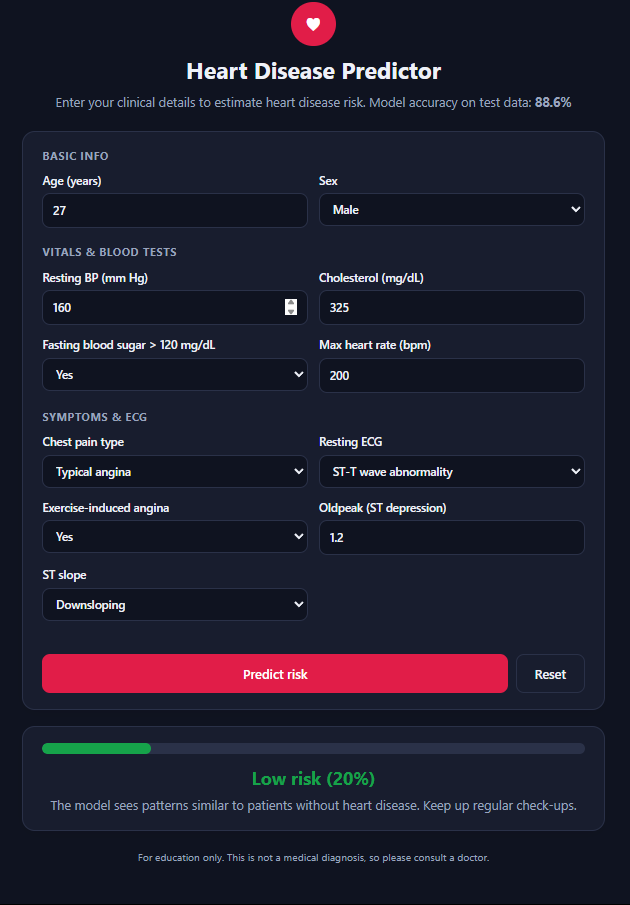

# ❤️ Heart Disease Predictor

A web app that estimates heart disease risk from clinical measurements.
A scikit-learn **SVM** model is served by **Flask**, with a front end built in plain **HTML, CSS and JavaScript**.



## Features
- Clean, responsive form (works on phone and desktop, with automatic dark mode)
- Server-side validation of every input
- Colour-coded risk result (low / moderate / high) with probability bar
- Missing cholesterol or blood pressure is filled with the training average

## Tech stack
| Part | Tools |
|---|---|
| Model | scikit-learn (encoding + scaling + SVM pipeline) |
| Backend | Flask, joblib, pandas |
| Frontend | HTML, CSS, JavaScript |

## Project structure
```
├── app.py              # Flask server and /predict endpoint
├── train_model.py      # trains the model and saves model.pkl
├── model.pkl           # trained pipeline
├── heart.csv           # dataset
├── requirements.txt
├── templates/index.html
├── static/style.css, script.js
└── notebooks/heart_.ipynb   # data exploration and model comparison
```

## Run locally
```bash
python -m venv venv
venv\Scripts\activate        # Mac/Linux: source venv/bin/activate
pip install -r requirements.txt
python train_model.py        # optional: rebuilds model.pkl
python app.py
```
Then open http://127.0.0.1:5000

## Model performance
Evaluated with 5-fold cross-validation on 918 patients:

| Metric | Score |
|---|---|
| Accuracy | about 86% |
| Recall (heart disease detected) | about 91% |

SVM was chosen after comparing it with KNN, Random Forest, Logistic Regression and Gradient Boosting. All scored within about 1 point of each other, so the limit comes mostly from dataset size.

## Dataset
[Heart Failure Prediction Dataset](https://www.kaggle.com/datasets/fedesoriano/heart-failure-prediction) (Kaggle), 918 patients, 11 features.

## ⚠️ Disclaimer
For education only. This is **not** a medical diagnosis. Please consult a doctor for health concerns.
